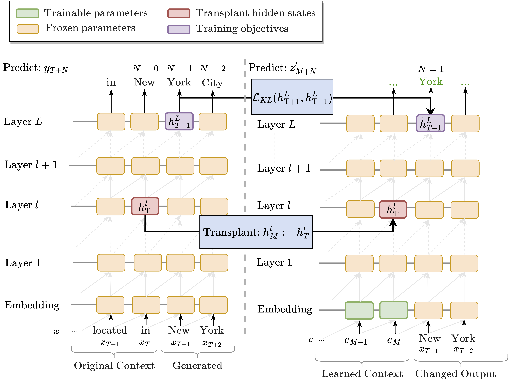

# Future-Lens
Code and Data Repo for the CoNLL 2023 Paper -- Future Lens: Anticipating Subsequent Tokens from a Single Hidden State



In this repo, we include two distinctive way to reveal the extent to which individual hidden states may directly encode subsequent tokens: 1) **Linear Model Approximation** and 2) **Causal Intervention Methods**. With the best result, we propose **Future Lens** as the tool to extract information about future (beyond subsequent) tokens from a single hidden token representation.

## Set-up
Run the following code to install the environment
```
pip install -r scripts/colab_reqs.txt
```
## Linear Model Approximation
To run the linear modoel approximation, you may run the following command:
```
python linear_methods/linear_hs.py
```

## Causal Method
To train a soft prompt for GPT-J, you may run the following command:
```
python causal_methods/train.py
```
And then test by running the following script:
```
python causal_methods/test.py
```
## Future Lens
We provide an online [demo](https://colab.research.google.com/github/KoyenaPal/future-lens/blob/main/demo/FutureLensDemonstration.ipynb) notebook for the Future Lens. You may also run the code locally from 
```
demo/FutureLensDemonstration.ipynb
```
## Updates

### Oct.6th 2023
Our paper is accepted by CoNLL 2023!

### Nov.8th 2023
We release the code and preprint version of the paper! 


## Contact
If any questions about the code, please contact Koyena at pal.k@northeastern.edu.
